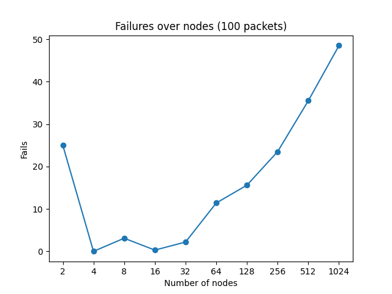

# Link Reversal Algorithm


The repository provides an implementation of a routing protocol for the NS3 (Network Simulator 3) framework that utilizes the link reversal algorithm. This approach is designed for routing in dynamic communication networks, such as mobile ad hoc networks. By assigning a direction to each network link, the algorithm converts the network into a destination-oriented Directed Acyclic Graph (DAG), enabling efficient routing in environments with frequently changing topologies.

## Environment

The simulation takes place in a 20 km². By default, nodes are initially arranged in a grid, with 20 meters of distance between them. Each node has a communication range of 25 meters, allowing it to connect only with nodes within that range. The nodes follow a random walk mobility model, which causes them to move unpredictably from their starting positions. All parameters, except for the area size, can be configured through the command line interface.

The environment is configured in the [setPhysicalEnvironment function](src/simulation-helper.cc#L32).

## Implementation

The implementation of the algorithm for the routing protocol consists of two phases. The first phase involves constructing the initial configuration, which should form a valid Directed Acyclic Graph (DAG). As mentioned earlier, each node must maintain a unique height. A packet can only travel from a node with a higher height to a node with a lower height. To simulate packet flow from a source to a sink, we assign the sink the lowest possible height (e.g., 0), while the other node heights are chosen randomly within the range 0 $<$ x $\leq$ MAX_INT. If node A has a higher height than node B, an outbound edge A $\rightarrow$ B will exist, otherwise, an inbound edge A $\leftarrow$ B will be present. This process ensures the construction of a topological sort, and consequently, a DAG.

The second phase is triggered whenever a node loses all of its outbound neighbors. If a node needs to forward a packet but has no outbound nodes within its range, it reverses all of its links, meaning that its inbound edges will become outbound edges. The algorithm is simple: we only need to increase the current node's height to be greater than the highest height of its inbound neighbors.

## Benchmarks

The simulation environment is highly customizable, enabling detailed benchmarking of the routing protocol's behavior and performance. Below are examples of benchmarks conducted, with all values being averages for the configurations used. You can run these benchmarks using the [benchmark.py](benchmark.py) script as follows:

```bash
$ python3 benchmark.py 

usage: benchmark.py [-h] [--plot] {time,failure_rate_speed,failure_rate_nodes}

Run benchmarks for lra-simulator.

positional arguments:
  {time,failure_rate_speed,failure_rate_nodes}
                        Select the benchmark to run.

options:
  -h, --help            show this help message and exit
  --plot                Plot the results after running the benchmark.

```

### Packet delivery times over nodes

This benchmark demonstrates how packet delivery times change as the number of nodes involved in packet forwarding increases. The configuration used for this simulation is as follows:

```
lra-simulator --benchmark --duration=1500 --packets=1 --nodes={n}
```

$2^1 \leq$ n $\leq 2^{12}$.


As shown in the plot, the delivery time increases with the number of nodes. This is due to the time required to reach a stable configuration after the reversal of edges.   

### Failures over speed

This benchmark illustrates the increasing number of packet failures as node speed increases. The speed of the nodes impacts the topology of the graph, which in turn requires more frequent link reversals to maintain a stable configuration. The configuration used for this simulation is:

```
lra-simulator --range=30 --nodes=30 --speed={n}
```

$2^0 \leq$ n $\leq 2^{12}$.


As the plot shows, after a certain speed threshold, all packets fail to be delivered because the topology changes too frequently for a stable configuration to be maintained.

### Failures over nodes

This benchmark examines how packet failures increase as the number of nodes grows. The configuration used for this simulation is:

```
lra-simulator --range=30 --speed=1.5 --nodes={n}
```

$2^1 \leq$ n $\leq 2^{10}$.



As seen in the plot, packet failures increase with the number of nodes due to the complexity of maintaining stable configurations in larger networks. However, more failures also occur when there are only two nodes, as there may be no other nodes available to forward the packet. Between 4 and 32 nodes, packet loss occurs in a random and unpredictable manner. After this range, packet loss becomes more consistent.

## Installation

### Requirements

- [ns-3 simulator v3.42](https://www.nsnam.org/).
- [c++ compiler](https://gcc.gnu.org/).
- [cmake](https://cmake.org/).
- [python3](https://www.python.org/).

The simulation uses the [ns-3 simulator](https://www.nsnam.org/), and has been developed and tested with the version 3.42.

### Build

First, make sure you have already completed all the step required for the installation of the simulator shown [here](https://www.nsnam.org/docs/release/3.42/tutorial/html/index.html).  
The directory structure should look something like this:

```bash
.
└── ns-allinone-3.42/
    └── ns-3.42/
        ├── ns3
        ├── examples/
        ├── src/
        ├── scratch/
        └── ...
```

Move to the `scratch` folder and clone the repository:

```bash
cd ns-allinone-3.42/ns-3.42/scratch
git clone https://github.com/v0lp3/NS3-LinkReversalAlgorithm.git
mv NS3-LinkReversalAlgorithm/* .
```

Lastly, move back to the `ns-3.42` folder and build the simulation:

```bash
cd ..
./ns3 run "lra-simulator --help"
```

### Usage

```bash
$ ./ns3 run 'lra-simulator --help'

Program Options:
    --nodes:      Number of nodes in the simulation. [10]
    --packets:    Number of packets to send in the simulation. [100]
    --sink:       ID of the sink node (node that receive the packet). [0]
    --source:     ID of the source node (node that send the packets). [0]
    --duration:   Simulation duration in seconds. [100]
    --range:      Max communication range between nodes. [25]
    --distance:   Initial distance between nodes. [20]
    --pcap:       Enable Pcap tracing [false]
    --ascii:      Enable ascii tracing [false]
    --speed:      Change the speed of nodes [1]
    --benchmark:  Execute benchmarks and output result in a file [false]

General Arguments:
    --PrintGlobals:              Print the list of globals.
    --PrintGroups:               Print the list of groups.
    --PrintGroup=[group]:        Print all TypeIds of group.
    --PrintTypeIds:              Print all TypeIds.
    --PrintAttributes=[typeid]:  Print all attributes of typeid.
    --PrintVersion:              Print the ns-3 version.
    --PrintHelp:                 Print this help message.
```

### Visualizing the simulation

To visualize the simulation, you can append the --visualize option when running the simulation:

```
./ns3 run 'lra-simulator' --visualize
```

> [!IMPORTANT]  
> Ensure that ns3 is configured with the PyViz visualizer


## References

- [Analysis of link reversal routing algorithms](https://www.ece.iastate.edu/snt/files/2015/10/sicomp05.pdf)
- [ns3](https://www.nsnam.org/documentation/)